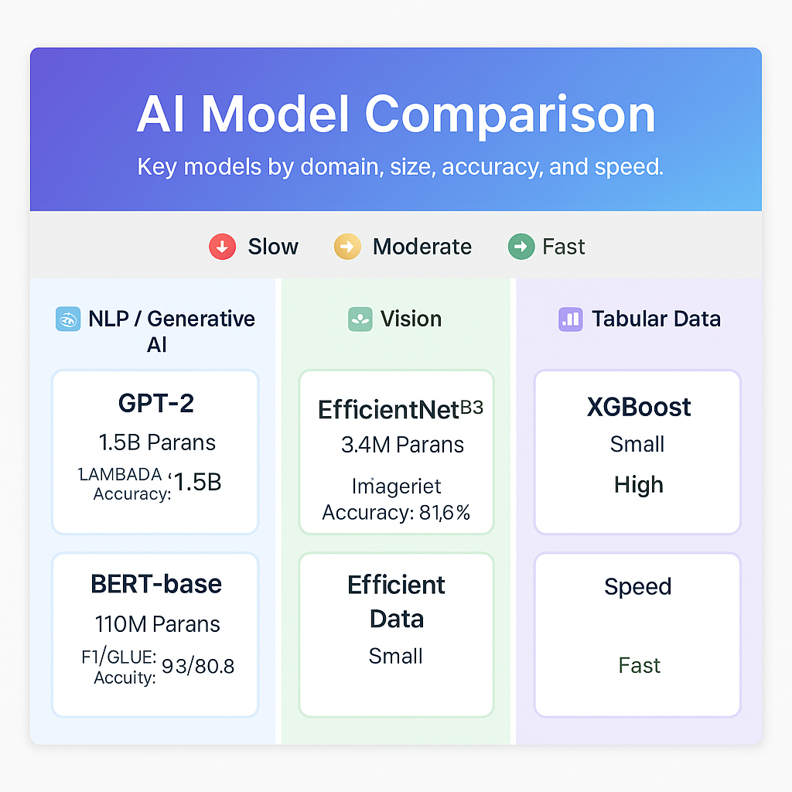

# 📊 Artifact: Pre-Trained Model Comparison Across AI Domains

---

## 🎯 Introduction

This artifact compares the top pre-trained models in three domains: natural language processing (NLP), computer vision (CV), and tabular data.  The emphasis is on evaluating the trade-offs between model size, inference speed, and correctness.

---

## 📘 Description

The artifact presents a decision matrix evaluating five well-known models:

- GPT-2 (NLP, generative tasks)
- MobileNetV2 (CV, mobile image classification)
- EfficientNet-B3 (CV, scalable high-accuracy vision)
- XGBoost (Tabular data, highly interpretable)
- BERT-base (NLP, embeddings/classification)

Each is measured against publicly available benchmarks for size (parameters), accuracy (benchmark scores), and inference speed (relative latency).  The choice matrix is presented below in both visual and written formats.

---

## 🎯 Objective

To help engineers and researchers:
- Understand performance trade-offs
- Make evidence-based model selection decisions
- Select domain-appropriate models based on constraints

---

## 🔧 Process

1. Selected representative models from three AI domains
2. Compared on three dimensions: Size, Accuracy, Speed
3. Created matrix as both table and image for visual clarity
4. Researched open benchmarks (Papers With Code, Hugging Face, etc.)

---

## 🛠️ Tools and Technologies Used

- Hugging Face Model Hub
- Markdown & Canva (for image)
- GitHub Pages (for hosting portfolio)
- Papers with Code

---

## 💡 Value Proposition

Offers a cross-domain visual decision framework for model selection.  Ideal for use in solution architecture, machine learning planning, and classroom demonstration.

---

## 🌟 Unique Value
Unlike single-domain comparisons, this matrix includes NLP, vision, and table AI.  It clearly communicates trade-offs and supports domain-aware decision-making.

---

## 🔗 Relevance

Choosing the correct model early minimizes deployment costs while increasing success.  This artifact displays effective AI comprehension for real-world applications.
---

## 📚 References

- [GPT-2](https://openai.com/research/gpt-2)
- [MobileNetV2](https://arxiv.org/abs/1801.04381)
- [EfficientNet](https://arxiv.org/abs/1905.11946)
- [XGBoost](https://arxiv.org/abs/1603.02754)
- [BERT-base](https://arxiv.org/abs/1810.04805)

---

## 🖼️ Visual Matrix

